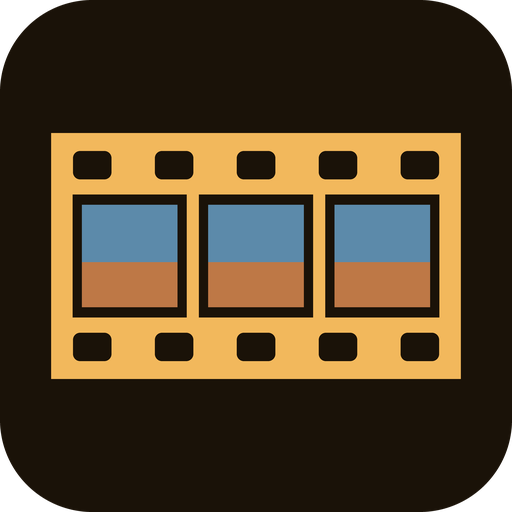

<p align="center">
  
</p>

<h1 align="center">Recipe Lab</h1>

<p align="center">
  Film simulations and camera looks for the <b>Sony A6000</b>, stored in the camera itself.<br>
  <sub>Version 1.0 · <a href="dist/RecipeLab.apk">Download the app</a></sub>
</p>

---

**Contents**

- [What it is](#what-it-is)
- [The recipes](#the-recipes)
- [Installing](#installing)
- [Using it](#using-it)
- [What it changes — and how to undo it](#what-it-changes--and-how-to-undo-it)
- [Troubleshooting](#troubleshooting)
- [For developers](#for-developers)
- [Credits](#credits)

---

## What it is

Recipe Lab is a small app that runs on the Sony A6000 itself. It comes with 77 colour recipes that recreate the looks
of other cameras — Fuji film simulations, Ricoh GR image controls, Leica, Hasselblad, Canon and Nikon colour, Sony's
newer Creative Looks — and of classic film stocks from Kodak, Fuji, Cinestill, Agfa and Ilford.

You turn the wheel, watch the live image change, press a button. From then on the camera shoots that way in **every
mode**, photo and video, with the app closed. Turn it off and on, it is still there.

> **Honest note.** The A6000 has no Picture Profile menu and cannot store tone curves. Every recipe is built only from
> what this camera *can* keep: Creative Style, saturation, contrast, sharpness, white balance, exposure bias, Picture
> Effect and one hidden colour setting Sony never exposed. So these are approximations of a look, not copies of another brand's colour science.

## The recipes

| brand | recipes |
|---|---|
| **Sony** | Factory (ST), PT, NT, VV, VV2, FL, IN, SH |
| **Fuji simulations** | Provia, Velvia, Astia, Classic Chrome, Classic Negative, Nostalgic Neg, Reala Ace, Pro Neg Std / Hi, Eterna, Eterna Bleach Bypass, Acros, Acros +Ye / +R / +G, Sepia |
| **Fuji film** | Pro 400H, Fortia 50, Superia 400, C200, Natura 1600 |
| **Kodak** | Portra 160 / 400 / 800, Gold 200, Ultra Max 400, Color Plus 200, Ektar 100, Ektachrome E100, Kodachrome 64, Vision3 500T, Vision 200T (Asteroid City), Tri-X 400, Tri-X 1600 (pushed), T-Max |
| **Cine** | Cinestill 50D, Cinestill 800T, Classic Cinema, Rec709 Video |
| **Ricoh GR** | Positive Film, Negative Film, Bleach Bypass, Retro, Cross Process, Hi-Contrast B&W, Hard Monotone, Soft Monotone |
| **Leica** | Contemporary, Classic, Eternal, Monochrom |
| **Hasselblad** | HNCS Natural |
| **Canon / Nikon** | Canon Standard / Portrait / Faithful, Nikon Flat / Vivid |
| **Panasonic / Olympus** | L.Monochrome D, L.ClassicNeo, Pop Art, Pale & Light |
| **Other stocks** | Agfa Vista 200, Agfa Ultra 100, Polaroid / Instax |
| **Ilford** | HP5, FP4, Delta 100, Delta 3200, Pan F 50 |

Recipes marked **PE** in the app (Nostalgic Neg, Asteroid City, Fuji Pro 400H, Acros +R, Tri-X 1600, GR Retro,
GR Hi-Contrast B&W, Sony SH, Polaroid) are built on a Picture Effect because, against the reference frames, its tone
curve gets closer than Creative Style can; everything else stays Creative Style on purpose.

Not included, because the camera simply cannot do them: log profiles (S-Log, V-Log, Blackmagic Film, Cinelike D) and
tinted black & white (selenium, cyanotype). Sony's camcorder *Cinematone* gamma exists in the firmware but the A6000's
camera layer neither lists nor accepts it, so that door is closed too.

## Installing

Takes about ten minutes, once. You need the camera, its USB cable, a memory card and a computer (Windows, Mac or
Linux).

**1. Get the installer tool.** It is called *Sony-PMCA-RE*, made by ma1co. It puts apps on Sony cameras the same way
Sony's own app store did before it closed.

- *Windows, easiest:* download `pmca-gui.exe` from the
  [releases page](https://github.com/ma1co/Sony-PMCA-RE/releases). Nothing to install, just run it.
- *Mac, Linux, or Windows without the GUI:* install Python 3, then in a terminal:

  ```
  git clone https://github.com/ma1co/Sony-PMCA-RE.git
  cd Sony-PMCA-RE
  pip install -r requirements.txt
  ```

**2. Download the app:** [`RecipeLab.apk`](dist/RecipeLab.apk) — click, then *Download raw file*.

**3. Prepare the camera.** Battery charged, memory card inside. In the camera menu go to
`Setup (toolbox icon) → USB Connection` and choose **Mass Storage**. Turn the camera on and plug it into the computer.
The camera screen should say *USB Mode*.

**4. Install.**

- *GUI:* open `pmca-gui.exe` → **Install app from file** → choose `RecipeLab.apk` → wait.
- *Terminal,* from the Sony-PMCA-RE folder (Linux: put `sudo` in front):

  ```
  python pmca-console.py install -f RecipeLab.apk
  ```

The camera will flicker, go black and switch modes a couple of times on its own. That is normal — do not press
anything. After about a minute the computer prints `Task completed successfully` and the camera is back on its
shooting screen.

**5. Unplug.** The app now lives under `MENU → Application → Application List → Recipe Lab`.

## Using it

1. Open **Recipe Lab** from the Application List. You see the live image with a panel at the bottom.
2. **Turn the control wheel** (the ring on the back). Every click is a different recipe and the live image changes
   immediately — this is exactly how your photos and videos will look.
3. To jump between brands press **Fn**. A list opens: brands on the left,
   recipes on the right. Left/right picks which column you are scrolling (the active one is amber), up/down or the
   wheel scrolls it, the image keeps following. Centre button on a brand jumps into its recipes; centre button on a
   recipe picks it and closes the list.
4. To see the image without any text press **AEL**: once for a tiny label, twice for nothing at all. The wheel still
   works. Press again to bring the panel back.
5. Like it? Press the **centre button**. A message confirms it was stored.
6. **Turn the camera off and on.** Done. The look is now the camera's default in every mode — P, A, S, M, movie —
   with the app closed.

A few extras:

| | |
|---|---|
| **up / down** | moves between the recipe line and the row of value chips. In the chip row, left / right walks the chips; press the centre button to focus one (it turns amber), then up / down changes its value, centre button again leaves it. Only the chips the recipe uses are shown: a **CS** (Creative Style) recipe shows style / saturation / contrast / sharpness / matrix, a **PE** (Picture Effect) recipe shows the effect and its sub-setting instead; quality, white balance, EV and DRO always. The legend at the bottom changes with each state |
| **C1** | developer tool: snapshot of all settings; press again after changing a menu item to see which slot it lives in |
| **TRASH** (bin button) | stages the factory look; centre button stores it |
| **shutter** | takes a picture with whatever you are previewing |
| **MENU** | leaves the app |

The small badge next to the recipe name tells you where you stand: **ACTIVE** — the camera already has these
values · **PREVIEW** — you are only looking, press the centre button to keep it · **PROTECTED** — the camera is not
accepting changes (see [Troubleshooting](#troubleshooting)).

## What it changes — and how to undo it

**What it actually does.** Recipe Lab sets the same things you could set by hand in the menus — Creative Style with
its contrast, saturation and sharpness sliders, white balance and its fine-tune, exposure compensation, Picture
Effect — plus one hidden switch that turns on a richer colour matrix the camera has but never shows. Recipes that
use a Picture Effect (Retro, Soft High-key, High Contrast Mono) behave like that menu item does: the camera ignores
Creative Style while it is on, and **it needs Quality = JPEG** — with RAW or RAW+JPEG set, the camera silently drops
the effect. Quality is therefore handled like this: the **Factory recipe carries your Quality** — it starts as
whatever the camera is set to, and if you change it there (QUALITY chip or Fn) the app remembers it. Every Creative
Style recipe uses that same Quality. Picture Effect recipes use it too when it is a JPEG setting, otherwise they use
JPEG Fine. Whenever storing a recipe would change the camera's Quality the app asks first (`Quality: RAW+JPG → JPG
Fine — JPEG is needed to apply this recipe`, *Accept* / *Cancel*); Cancel stores nothing. The QUALITY chip changes it
any time. The app also reopens on the recipe you last selected. It does not modify the
camera's firmware or operating system and needs no unlocking or "jailbreak". Installing it uses the same mechanism
Sony used for its own downloadable apps.

**Is it permanent?** The look stays until you change it — on purpose, that is what makes it work in every mode
without the app. It is not permanent in the sense of damage. Undo it any time, three ways:

- In the app: **TRASH**, then the **centre button**, then turn the camera off and on.
- In the menus: set Creative Style back to *Standard* 0 / 0 / 0 and White Balance to *Auto*.
- Or use the camera's own `Setup → Setting Reset → Camera Settings Reset`.

**Worth knowing:**

- Some recipes push saturation further than the menu slider goes (the menu allows ±3, the camera accepts more). The
  menu then shows the nearest value it can; if you touch that slider it snaps back to the normal range and the
  recipe loses that extra punch. Re-store from the app if that happens.
- The preview inside the app is temporary; closing the app removes it. Only what you *stored* stays.
- Uninstalling the app does **not** put the colour settings back. Undo first (any of the three ways above), then
  remove it via `MENU → Application → Application Management → Manage and Remove → Recipe Lab`.
- Built and tested on the A6000 with firmware 3.21. Other Sony bodies of the same generation probably keep these
  settings in the same place, but nobody has checked — compare what the chips show with your menus before storing.

## Troubleshooting

| what you see | what to do |
|---|---|
| `No devices found` | USB Connection must be *Mass Storage*; card inserted; camera on and showing *USB Mode*; try another cable or port |
| Stuck at `Waiting for camera to switch...` | Unplug, turn the camera off and on, reconnect, run again |
| Badge says **PROTECTED** | The camera's settings store is write-protected. Install [OpenMemories-Tweak](https://github.com/ma1co/OpenMemories-Tweak), turn off *Backup protection*, try again |
| Look not applied after storing | Turn the camera off and on |
| `no live preview: ...` in the panel | Something else is holding the camera; close and reopen the app |
| Text shows `·` | Old build; install the APK from `dist/` |

## For developers

```
AndroidManifest.xml            package com.voxivoid.recipelab
src/com/voxivoid/recipelab/
  MainActivity.java            UI state, key handling, live preview (CameraEx via reflection), store + sync
  Recipes.java                 the 77 recipes, brands, GROUP_START / GROUP_COUNT
  res/raw/ids.txt              every settings entry of 16 bytes or less, used by the Fn snapshot/diff tool
  PickerView.java              Canvas-drawn brand browser
  Legend.java                  Canvas-drawn key icons, fit-to-width (camera font has no symbol glyphs)
  HintBar.java                 legend view under the panel (uses Legend)
  NativeBackup.java            JNI: read / write / attr / sync / isProtected
jni/jni.cpp                    Backup_read / Backup_write / Backup_sync_all via OpenMemories-Platform
jni/platform/                  git submodule: ma1co/OpenMemories-Platform
res/                           layout, shape drawables, launcher icon
build.cmd                      full Windows build → RecipeLab.apk (+ copy to dist/)
```

**Settings slots** (found by disassembling the camera app's parameter registration in `libObj.so`):

| setting | id | notes |
|---|---|---|
| Creative Style | `0x01070175` | index in the runtime `color-mode-values` list (1 standard, 2 vivid, 3 neutral … 6 mono; verified) |
| Contrast | `0x01070178` | signed byte |
| Saturation | `0x01070187` | signed byte, core accepts ±16 |
| Sharpness | `0x0107018a` | signed byte |
| Picture Profile no. | `0x0107031c` | 0 off, 3 = alternate colour matrix (no gamma on this body) |
| WB mode | `0x01070019` | 1 auto, 14 colour temperature |
| WB Kelvin | `0x01070018` | Kelvin / 100 |
| WB A-B / G-M | `0x01070017` / `0x01070016` + per-mode copies: AWB `0x0107067f` / `0x0107067e`, colour temp `0x01070683` / `0x01070682` | signed, magenta positive (menu G1 = 0xff). The camera applies the per-mode copy (verified end-to-end) |
| Picture Effect | `0x010706f1` | index in `picture-effect-values` (verified: Retro = 4) |
| Effect sub-setting | `0x010709d8` high-key tint · `0x010706f3` toy tone · `0x010706ee` partial-colour hue · `0x010706ef` posterization | index in the runtime value list (provisional) |
| Exposure bias | `0x010700b8` + copy `0x01070c7f` | 1/3 EV steps, signed (verified: +0.7 = 2); both written |
| DRO | `0x01070104` (+ level byte `0x01070775`) | Off 0, Auto 1, Lv1–5 = 2–6; level byte 1 for Off/Auto, Lv n = n+1 (verified) |
| Quality: file format | `0x01070013` (+ mirror `0x01070aa9`) | RAW = 1, RAW+JPEG = 2, JPEG = 0 (verified) |
| Quality: JPEG level | `0x01070014` (+ mirror `0x01070aaa`) | Std = 0, Fine = 1 (verified) |

**Exit rule:** the camera writes some live parameters (exposure bias, WB fine-tune) straight back into the settings
store, so on exit the app sets the live parameters to the *stored* values rather than to its launch snapshot —
otherwise a freshly stored recipe would be undone the moment the app closes.

**Live preview** goes through `Camera.Parameters`: `color-mode`, `saturation`, `contrast`, `sharpness`,
`whitebalance`, `color-temperture-white-balance`, `light-balance-for-white-balance`,
`color-compensation-for-white-balance`, `rgb-matrix` (Q10, 1.0 = 1024) + `rgb-matrix-mode`, `picture-effect`,
`exposure-compensation` (1/3 EV steps), `dro-mode` + `dro-level`.
**Key scan codes:** wheel 522 / 523, top dial 525 / 526, AEL 532, C1 622, Fn 520, trash 595, centre 232, MENU 514.

**Build** (Windows): JDK 17, Android SDK build-tools 30.0.3 with a platform jar (API 28), and **NDK r16b** — the last
one with the GCC toolchain this Android 2.3.7 target needs.

```
git clone --recursive https://github.com/voxivoid/recipe-lab-sony-a6000.git
cd recipe-lab-sony-a6000
set ANDROID_NDK=C:\path\to\android-ndk-r16b      REM optional: JAVA_HOME, ANDROID_SDK, BUILD_TOOLS, PLATFORM_JAR
build.cmd
```

`build.cmd` parks the platform's `errno.h` shim (updater-only, shadows the NDK header), runs ndk-build, aapt, javac
(`-encoding UTF-8`), d8 (as `java -cp d8.jar`, because `d8.bat` uses whatever Java is on PATH), zipalign and
apksigner (v1 only, throw-away keystore generated on first run).

Adding a recipe is one line in `Recipes.java` inside its brand block. Adding a brand is a new entry in `GROUPS` plus
a block of recipes.

## Credits

**Author:** [André Domingues (voxivoid)](https://github.com/voxivoid) — reverse engineering of the A6000 settings
store (backup IDs, PP flag behaviour, colour-matrix measurement), the app, the recipes, the icon.

**Huge thanks to [ma1co](https://github.com/ma1co).** None of this would exist without his years of work reverse
engineering Sony's PlayMemories camera platform:

- [Sony-PMCA-RE](https://github.com/ma1co/Sony-PMCA-RE) — the app-install channel, the updater shell used to dump
  this camera's firmware and settings, and `fwtool`.
- [OpenMemories-Platform](https://github.com/ma1co/OpenMemories-Platform) — the backup driver / OSAL bindings this
  app links against (vendored here as a git submodule).
- [OpenMemories-Tweak](https://github.com/ma1co/OpenMemories-Tweak) and
  [OpenMemories-Framework](https://github.com/ma1co/OpenMemories-Framework) — reference for `Backup_read/write`,
  the `ScalarInput` key codes and the `CameraEx` API.
- The earlier nex-hack community research he built on and kept documented.

He figured out how these cameras work, documented it openly and licensed it permissively — this project just stands
on that.

Recipe names follow the popular film-simulation lists; the values are original approximations for this body.

License: MIT (this repository). OpenMemories-Platform: MIT, © 2017 ma1co.
